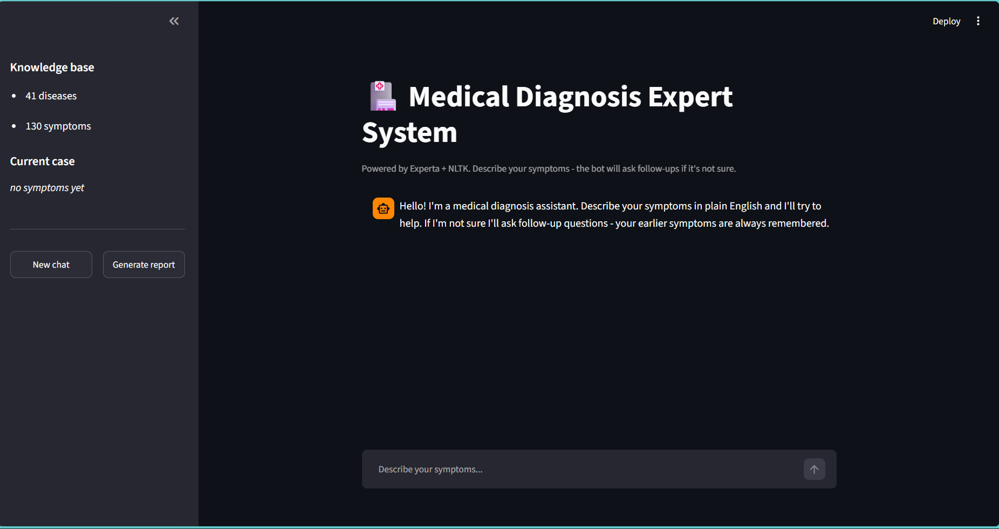
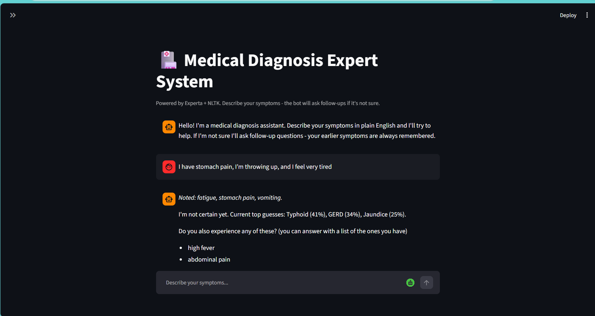
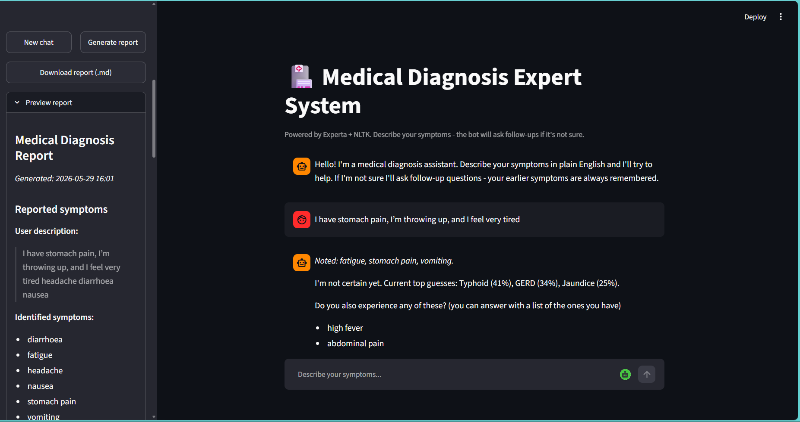

# Medical Diagnosis Expert System

A simple medical diagnosis expert system with a chatbot interface and a Streamlit UI. This repository contains code for processing medical data, applying simple expert-system logic, and interacting via a chatbot or a web app.

## Features
- Rule-based expert system for basic medical diagnosis
- NLP preprocessing utilities
- Chatbot interface
- Streamlit-based demo UI

## Repository Structure
- `chatbot.py` : Chatbot interface and dialogue handling
- `expert_system.py` : Core expert system logic and rules
- `nlp_processor.py` : Natural language processing helpers
- `streamlit_app.py` : Streamlit UI for the system
- `Medical Diagnosis Expert System.csv` : Example dataset used by the project

## Requirements
- Python 3.8+
- Recommended packages: `streamlit`, `pandas`, `scikit-learn`, `nltk`

You can install the typical dependencies with:

```bash
python -m venv .venv
source .venv/bin/activate   # On Windows use: .venv\\Scripts\\activate
pip install -r requirements.txt  # If you have a requirements file
pip install streamlit pandas scikit-learn nltk
```

## Running

Run the Streamlit app (recommended demo):

```bash
streamlit run streamlit_app.py
```

Run the chatbot directly (if implemented):

```bash
python chatbot.py
```

## Usage
- Open the Streamlit URL shown in the terminal after running the app and interact with the UI.
- Use the chatbot CLI for quick text-based interactions.

## 📸 Screenshots

### Streamlit Home Page


### Chatbot Interface


### Diagnosis Result


## Notes
- If you don't have a `requirements.txt`, consider creating one from your environment:

```bash
pip freeze > requirements.txt
```

## License
Add a license of your choice or contact the project owner for licensing information.
